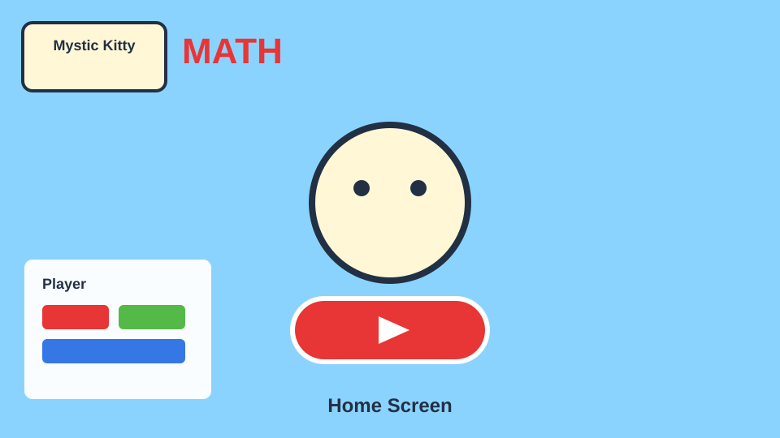
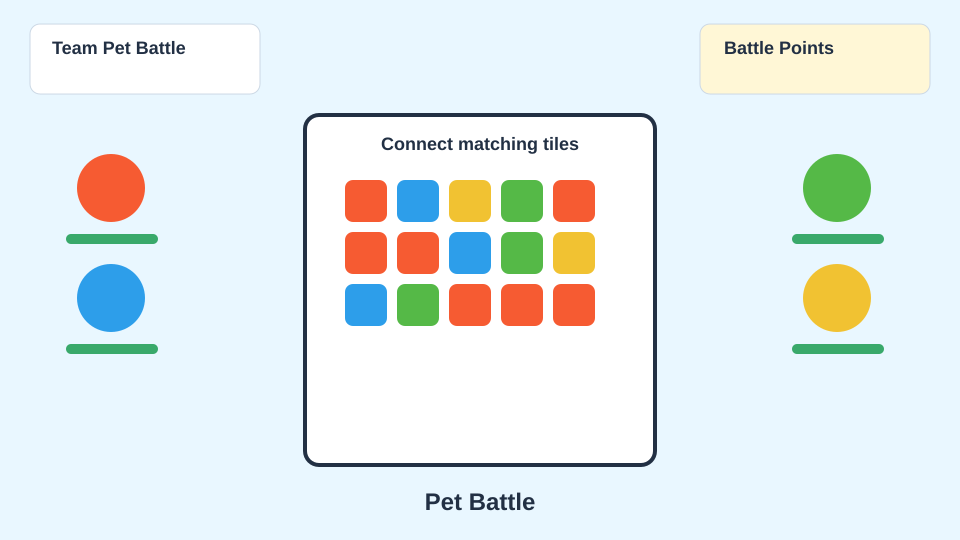
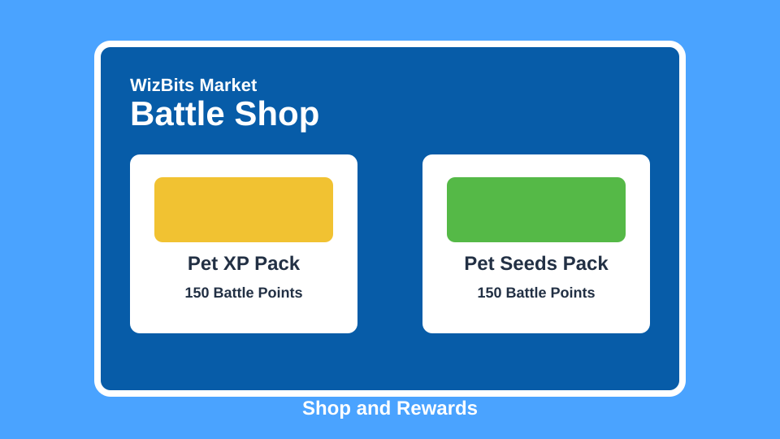

# WizBits

WizBits is a kid-friendly math and pet battle game inspired by classroom battle games. Players collect pets, build a four-pet elemental team, solve math questions, match element tiles, earn rewards, and unlock new modes through adventure, challenges, events, matchmaking, and local friend battles.

The current browser game is built with HTML, CSS, JavaScript, and Three.js. A small Node/Express backend scaffold is included for the next Neon/Postgres and Linode hosting step.

## Snapshots

These snapshots show the main flows in the game.







## Features

- Player login with local save data
- Home screen with mascot, shop, backpack, My Pets, Grow Pets, and Battle a Friend
- Adventure mode with locked progression across zones
- Challenges and events battle modes
- Matchmaking battles with Battle Points rewards
- Local friend code screen for adding saved local profiles as friends
- Four-element pet teams: Fire, Water, Electric, and Grass
- Element strengths:
  - Fire beats Grass
  - Grass beats Electric
  - Electric beats Water
  - Water beats Fire
- Connect adjacent matching tiles, including diagonals, to attack
- Fourth-grade-style math questions with timed challenges
- Pet shop, mascot shop, backpack, and My Pets team selection
- Grow Pets flow using Pet Seeds
- Battle Shop purchases using Battle Points

## How To Run

From the project folder:

```bash
python3 -m http.server 5174
```

Then open:

```text
http://127.0.0.1:5174/
```

Use a local server instead of opening `index.html` directly, because the game uses JavaScript modules and browser storage.

For the Linode/Neon backend scaffold:

```bash
npm install
cp .env.example .env
npm start
```

Before using the backend against Neon, run [server/db/schema.sql](/media/poseidon/HDD2/projects/wizbits/server/db/schema.sql) in the database.

## How To Play

1. Enter a player name on the login screen.
2. Use the red play button to open the play menu.
3. Pick a mode: Adventure, Matchmaking, Challenges, Events, Quiz Mode, My Pets, Grow Pets, or Battle vs Friend.
4. In battle, choose an opposing pet target.
5. Connect matching element tiles on the board. Longer chains do more damage.
6. After a few attacks, solve the math question to continue.
7. Win battles to earn XP, Wiz Bucks, Pet Seeds, or Battle Points depending on the mode.

## Rewards

- Adventure wins give XP, Wiz Bucks, and Pet Seeds.
- Matchmaking wins give Battle Points, up to the daily cap.
- Battle Points can buy Pet XP and Pet Seeds in the Battle Shop.
- Pet Seeds can grow a new pet when the Grow Pets counter reaches `10/10`.

## Project Structure

```text
index.html       Main page and screens
style.css        Game layout, menus, battle UI, shop UI
main.js          Game state, battle logic, shop logic, saves
assets/          Runtime game assets tracked in Git
server/          Express, Neon Postgres, and WebSocket hosting scaffold
docs/snapshots/  README snapshot previews
plan/            Local planning notes and rough reference material, ignored by Git
```

## Notes

The game currently saves progress in `localStorage`, so progress is per browser and device.

The `plan/` folder is ignored by Git. Production assets used by the game should live under `assets/` so they are available after cloning and deployment.
